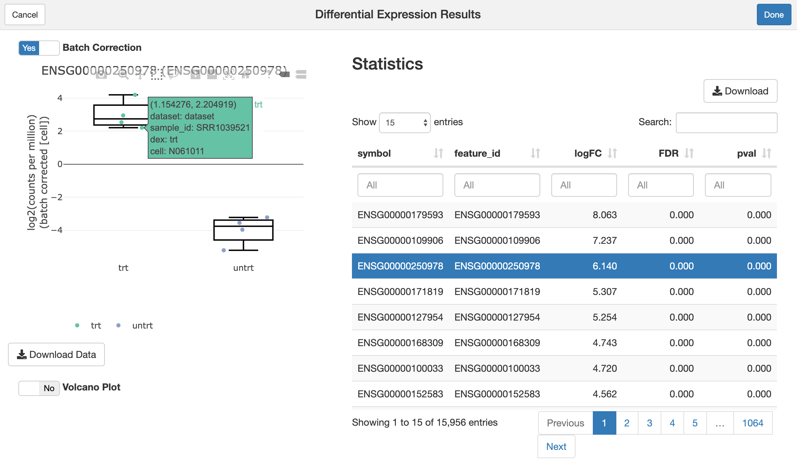

<!-- README.md is generated from README.Rmd. Please edit that file -->

```{r, echo = FALSE}
knitr::opts_chunk$set(
  collapse = TRUE,
  echo = TRUE,
  message = FALSE,
  error = FALSE,
  comment = "#>",
  fig.path = "man/figures/README-"
)
```

# FacileBiocData

<!-- badges: start -->
[](https://github.com/facilebio/FacileBiocData/actions)
[](https://www.repostatus.org/#active)
[](https://www.tidyverse.org/lifecycle/#maturing)
[](https://codecov.io/gh/facilebio/FacileBiocData?branch=master)
<!-- badges: end -->

The `FacileBiocData` package enables the use of Bioconductor-standard  data
containers, like a `SummarizedExperiment`, `DGEList`, `DESeqDataSet`, etc. as
"first-class" data-providers within the facile ecosystem.

## Example Usage

The user simply needs to call the `facilitate` function on their data container
in order to make its data available via the facile API, so that it can be
analyzed within the facile framework.

```{r data-init, message=FALSE, warning=FALSE}
library(FacileBiocData)
data("airway", package = "airway")
airway.facile <- facilitate(airway, assay_type = "rnaseq")
```

We can now use `airway.facile` as a first-class data-providedr within the facile
framework. For instance, we can use the [FacileAnalysis][] to perform a
differential expression analysis using the edgeR or limma based framework:

```{r, message=FALSE, warning=FALSE}
library(FacileAnalysis)
dge.facile <- airway.facile %>% 
  flm_def("dex", numer = "trt", denom = "untrt", batch = "cell") %>% 
  fdge(method = "voom")
```

We can extract the statistics from the `fdge` result:

```{r}
tidy(dge.facile) %>% 
  select(feature_id, logFC, pval, padj) %>% 
  arrange(pval) %>% 
  head()
```

Produce an interactive visual (via using plotly/htmlwidgets) from one of the
results using `viz()`
```{r, eval = FALSE, message=FALSE, warning=FALSE}
viz(dge.facile, "ENSG00000165995")
```


Or, finally, launch a shiny gadget over the `fdge()` result so that we can
interactively explore the differential expression result in all of its glory:

```{r eval = FALSE, message=FALSE, warning=FALSE}
shine(dge.facile)
```


You can refer to the [RNA-seq analysis vignette][franseq] vignette in the
[FacileAnalysis][] package in order to learn how you can interactively analyze
and explore RNA-seq data in the facile.bio framework.

[FacileAnalysis]: https://facilebio.github.io/FacileAnalysis/
[franseq]: https://facilebio.github.io/FacileAnalysis/articles/FacileAnalysis-RNAseq.html
